# AI-Career-Co-pilot


https://ai-career-co-pilot-kpaoxn6jtw32uhlkcm5o49.streamlit.app/


## 🚀 AI Career Copilot

An end-to-end AI-powered career assistant that helps users analyze resumes, match jobs, identify skill gaps, generate personalized learning roadmaps, practice mock interviews, and calculate recruiter-style fit scores using RAG (Retrieval-Augmented Generation), FAISS vector search, and LLMs powered by Groq.

## Built with:

⚡ FastAPI (REST APIs)

🎨 Streamlit (Interactive UI)

🧠 Groq LLMs

🔍 FAISS Vector Search

📄 PDF Resume Parsing

🧩 LangChain

🗄️ SQLite

🤖 Sentence Transformers

## 📌 Features

📄 Resume Upload & Processing

Upload PDF resumes

Extract text using PyMuPDF

Semantic chunking using LangChain

Generate embeddings with SentenceTransformers

Store vectors in FAISS for semantic retrieval

## 💬 Resume Q&A Chat (RAG)

Ask questions about your resume like:

“What backend technologies do I know?”

“Summarize my ML experience”

“What projects are most relevant for AI Engineer roles?”

The system:

Retrieves relevant resume chunks from FAISS

Builds contextual prompts

Sends them to Groq LLM

Returns grounded answers

## 🎯 Job Description Matching

Compare your resume against any job description.

Provides:

Matching skills

Missing requirements

Compatibility assessment

Improvement suggestions

## 📊 Skill Gap Analysis

Identify:

Skills you already have

Missing technologies

Partial knowledge areas

Priority learning recommendations

## 🗺️ Personalized Learning Roadmap

Generate phased roadmaps for target roles like:

AI Engineer

ML Engineer

Backend Developer

Data Scientist

Includes:

Topics to learn

Free resources

Projects to build

Progress milestones

## 🎤 Mock Interview Generator

AI-generated:

Technical questions

Behavioral questions

Situational questions

Culture-fit questions

Each question includes:

What interviewer expects

Difficulty level

Answering tips

## 📈 Recruiter Fit Score

Get recruiter-style evaluations:

Skills match score

Experience relevance

Education fit

Overall hiring recommendation

## 🏗️ System Architecture

```text
                +----------------------+
                |     Streamlit UI     |
                |  Interactive Frontend|
                +----------+-----------+
                           |
                           v
                +----------------------+
                |    Business Logic    |
                |    RAG Pipelines     |
                | Resume Intelligence  |
                +----------+-----------+
                           |
        +------------------+------------------+
        |                                     |
        v                                     v
+-------------------+              +----------------------+
|    SQLite DB      |              |   FAISS Vector DB   |
|-------------------|              |----------------------|
| Users             |              | Resume Embeddings    |
| Resumes           |              | Semantic Search      |
| Chat History      |              | Similarity Retrieval |
| Analyses          |              +----------------------+
+-------------------+
                           |
                           v
                +----------------------+
                |      Groq LLM        |
                |  AI Response Engine  |
                +----------------------+
```
## 🧠 RAG Pipeline

```text
Resume Q&A Flow

PDF Resume
    ↓
Text Extraction
    ↓
Semantic Chunking
    ↓
Embedding Generation
    ↓
FAISS Indexing
    ↓
User Query
    ↓
Similarity Search
    ↓
Relevant Chunks Retrieved
    ↓
Prompt Construction
    ↓
Groq LLM Response
```
# 📸 Application Screenshots


## 🔐 Register Page


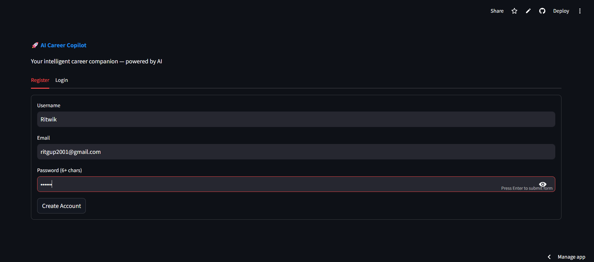


## 📄 Sample Resume


Resume used to generate Screenshots

[📥 Download Sample Resume](Ritwik%20Gupta%20resume%20GenAI1.pdf)


## Resume Upload


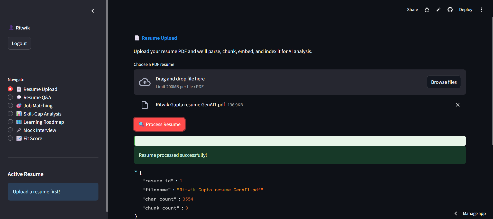


## Resume Question Answer


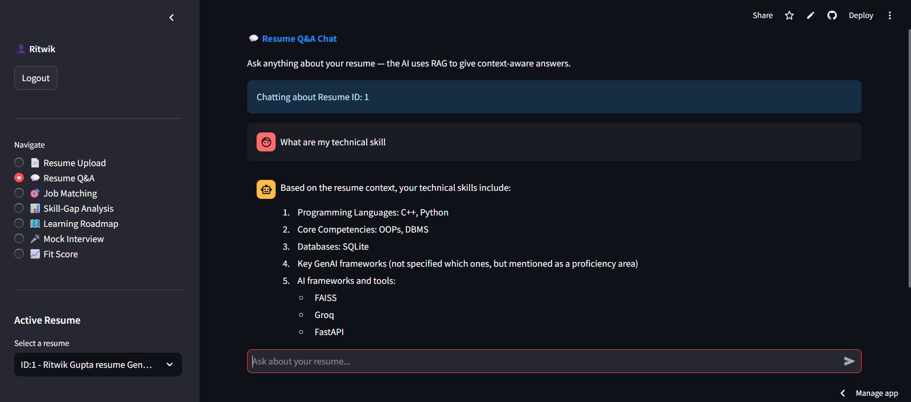

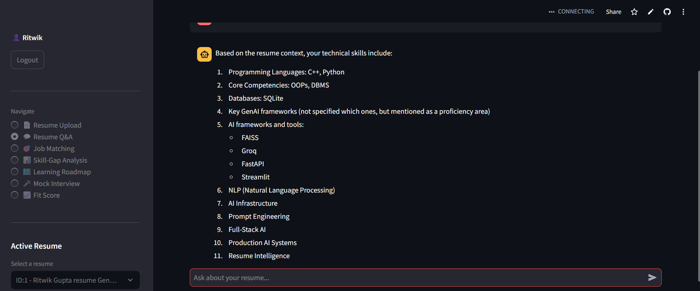


## Job Matching

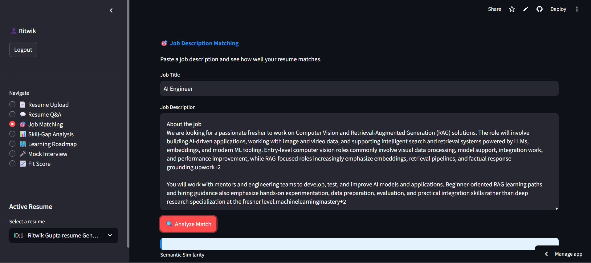

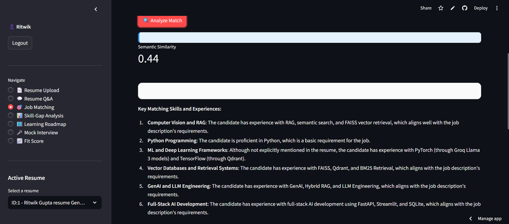

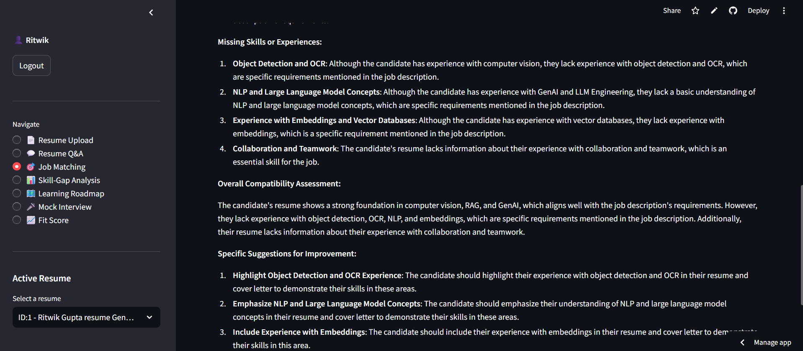


## Skill Gap Analysis


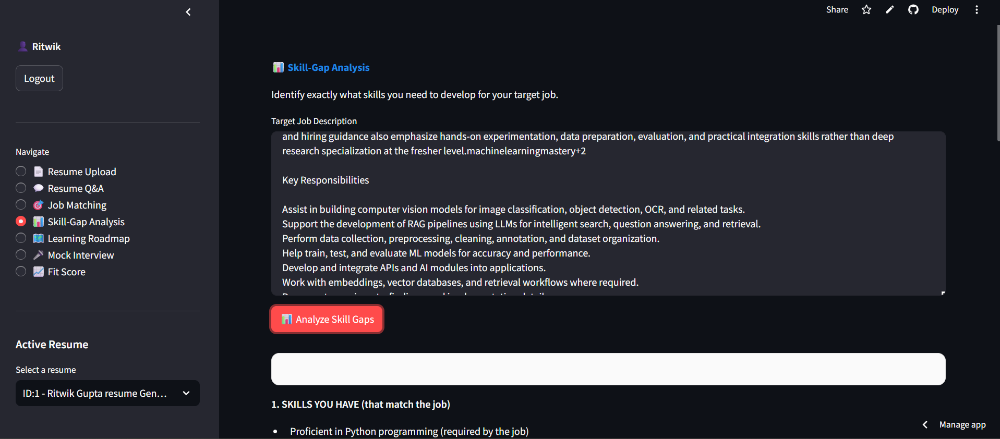

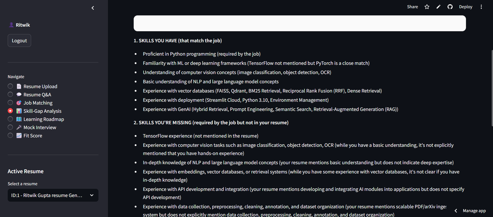

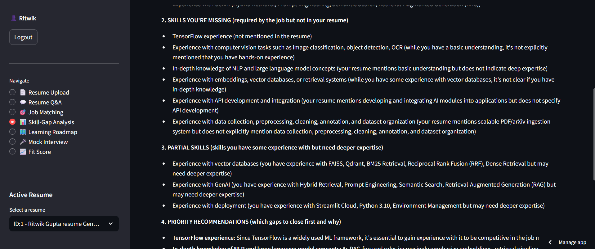

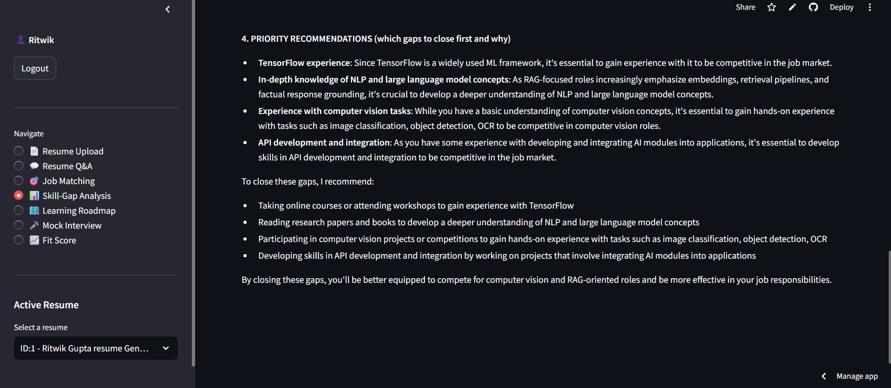


## Learning Roadmap

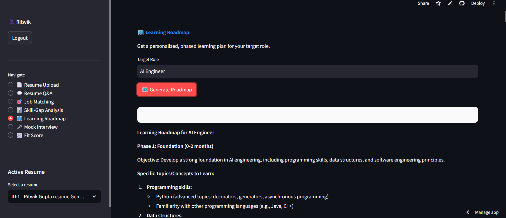

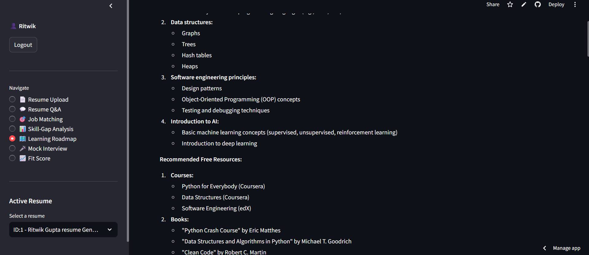

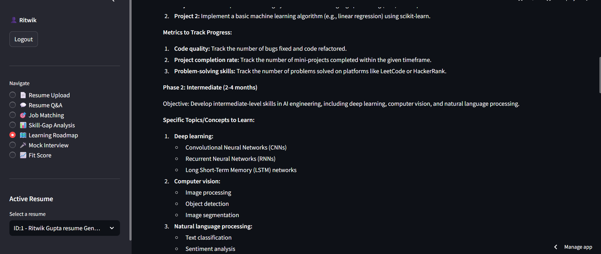

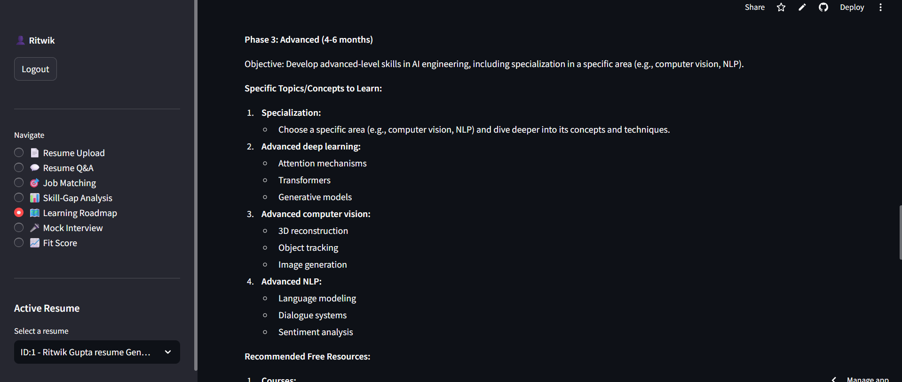


## Mock interview for desired role

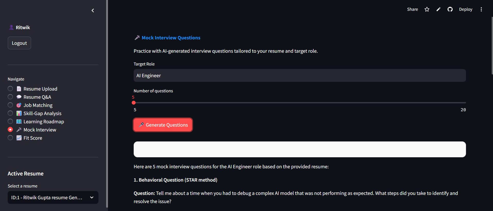

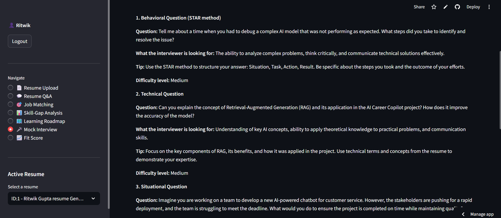


## Fit Score

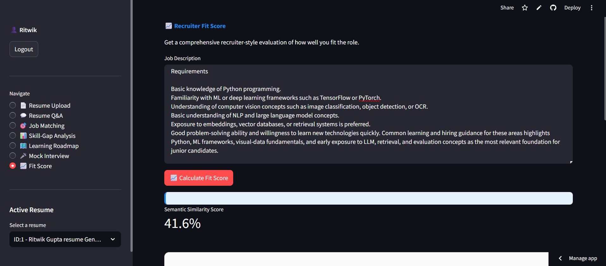

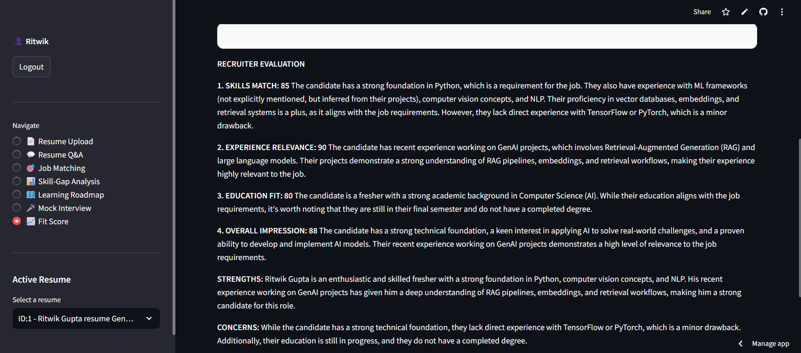

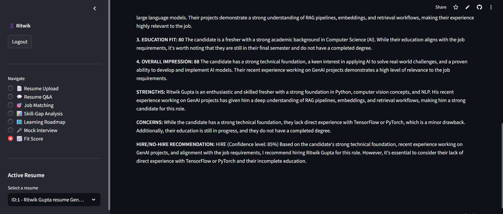

